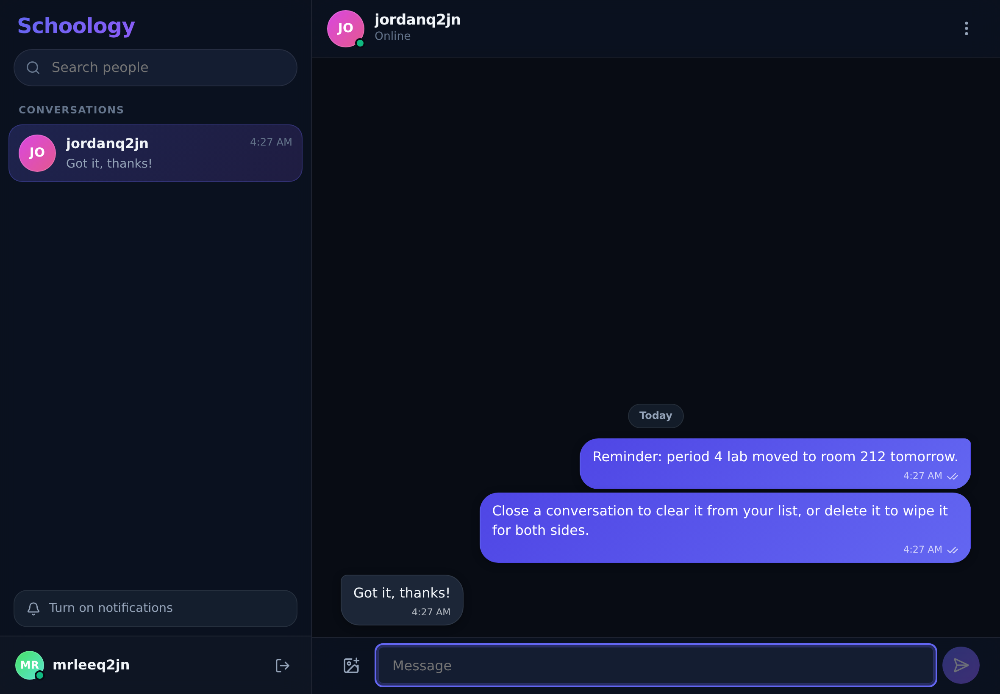

# Schoology 2.0

A real-time one-to-one chat app that is **100% static**, deploys to **Firebase
Hosting** (not App Hosting), and runs entirely inside the **free Spark plan —
no billing account, no credit card**. It is tuned specifically for **iPad 9th
and 10th generation**.

This is a ground-up rebuild of [`Chat_app`](../Chat_app), keeping that app's
look and feel while replacing everything that required a paid server.



---

## Why it was rebuilt instead of ported

Chat_app v1 is a Next.js app whose entire backend is server code: `/api/auth/*`,
`/api/messages`, `/api/upload`, `/api/push/subscribe`, JWT session cookies, a
Redis database and Vercel Blob storage. Firebase **Hosting** is a static CDN —
it serves files, it does not run code. So none of that could come along.

| v1 (Vercel, paid services) | 2.0 (Firebase Spark, free) |
| --- | --- |
| Next.js API routes | No server at all — the client talks to Firebase directly |
| Redis (`REDIS_URL`) for users and messages | Cloud Firestore, with live `onSnapshot` listeners |
| Hand-rolled JWT in an httpOnly cookie | Firebase Authentication (email/password) |
| Vercel Blob for image uploads | Images compressed in-browser and inlined into the message |
| `web-push` + VAPID keys from a server route | Local notifications raised by the page itself |
| 3-second polling loop | Real-time streaming; nothing polls |

What *was* carried over: the Schoology visual language (dark glass, indigo→violet
gradient, bubble styling), the sidebar + conversation two-pane layout, username
search, recent conversations, image attachments, unread counts and the
notification opt-in flow.

---

## What it does

- Username sign-up and sign-in
- Find anyone by username prefix search
- Real-time one-to-one messaging — messages appear as they are sent, no polling
- Photo messages, compressed on-device before sending
- Unread badges, read receipts, typing indicators and online presence
- **Close a conversation** to hide it from your own list — the other person
  keeps their copy, and a new message brings it back
- **Delete a conversation** to erase every message in it, for both people
- **Admin dashboard** listing every account, with block / unblock and a full
  data purge (see the caveat under *Honest limits*)
- Works offline: reading and sending both keep working, and queued messages
  flush when the connection returns
- Installs to the iPad Home Screen as a full-screen app

---

## Built for iPad 9th & 10th gen

Both target devices, in both orientations:

| Device | Landscape | Portrait |
| --- | --- | --- |
| iPad 9th gen (10.2") | 1080 × 810 pt | 810 × 1080 pt |
| iPad 10th gen (10.9") | 1180 × 820 pt | 820 × 1180 pt |

**Layout.** One breakpoint at 1000px decides everything. Above it (both devices
in landscape) the conversation list is permanently docked beside the thread.
Below it (both devices in portrait) the list becomes a slide-over drawer.
Because the test is viewport width and not a device sniff, **Split View, Slide
Over and Stage Manager get the correct layout automatically** — Schoology in a
half-width pane behaves exactly like portrait.

**The keyboard.** `100vh` is wrong on iPadOS and `100dvh` is not enough: the
floating keyboard, the split keyboard, Safari's collapsing toolbar and Stage
Manager resizes all change the visible area without a reliable window resize.
`useViewportFit` tracks `visualViewport` and publishes `--app-height`,
`--viewport-offset` and `--keyboard-inset`, which the layout is built on. This
is what stops the composer sliding under the keyboard.

**Touch.** Every control is at least 44 × 44 pt (Apple HIG); conversation rows
are 68 pt tall. `touch-action: manipulation` removes the 350 ms double-tap-zoom
delay, tap highlights are suppressed, and long-pressing a button no longer
raises the iPadOS callout menu — while message text stays selectable and
copyable.

**No accidental zoom.** Every input is ≥ 16px, because Safari zooms the page
whenever a focused field is smaller and then leaves it zoomed. Page zoom itself
is deliberately left enabled for accessibility.

**Rounded corners and the home indicator.** `viewport-fit=cover` plus
`env(safe-area-inset-*)` throughout, which matters on the 10th gen (no home
button) and in the installed full-screen app.

**Hardware keyboards.** With a Magic Keyboard or Smart Keyboard Folio attached,
Return sends and ⌘K jumps to search; with the on-screen keyboard up, Return
inserts a newline instead, because there is no other way to type one. Schoology
tells the two cases apart by whether the software keyboard is occupying the
viewport.

**Scrolling.** Momentum scrolling inside panes, `overscroll-behavior: contain`
so a flick at the end of the thread does not rubber-band the whole web view,
and no page bounce anywhere else.

**Other.** Photos capped at 1280px and re-encoded for a 2× retina panel; HEIC
photos straight from the iPad camera decode correctly; the system font (SF Pro)
is used instead of a downloaded web font; dark and light mode both supported;
`prefers-reduced-motion` respected.

---

## Stack

- **Vite 6** + **React 19** + **TypeScript** — builds to plain static files
- **Firebase Authentication** — email/password
- **Cloud Firestore** — messages, profiles, presence, with offline persistence
- **Firebase Hosting** — free static hosting with SSL on `*.web.app`
- `lucide-react` for icons; CSS Modules for styling; no UI framework

Roughly 280 KB gzipped in total, split so the app shell paints before the
Firebase SDK finishes loading.

---

## Quick start

```bash
npm install
cp .env.example .env        # fill in your Firebase web config
npm run dev
```

Then deploy:

```bash
npm run build
firebase deploy --only hosting,firestore
```

Full walkthrough, including creating the Firebase project without a card:
**[DEPLOY.md](DEPLOY.md)**. Shipping a change afterwards, from GitHub
Codespaces or anywhere else: **[UPDATING.md](UPDATING.md)**.

Working locally without touching your real project:

```bash
echo "VITE_USE_EMULATORS=1" >> .env.local
firebase emulators:start --only auth,firestore
npm run dev
```

---

## Project layout

```
firebase.json          Hosting config: SPA rewrite, cache headers, emulators
firestore.rules        The entire backend's security model lives here
firestore.indexes.json Composite index for the conversation list query
index.html             iPad meta tags: viewport-fit, apple-mobile-web-app, icons
public/sw.js           App-shell service worker (offline launch)
public/firebase-config.js  Optional runtime config, for re-pointing a built copy
scripts/make-icons.py  Regenerates the PNG icons, no dependencies needed

src/firebase.ts        SDK init, offline cache, username→address bridge
src/lib/chat.ts        Every Firestore read and write in the app
src/lib/admin.ts       Admin-only operations: user list, block, purge
src/lib/image.ts       In-browser photo compression
src/lib/notify.ts      Local notifications
src/hooks/useSession.ts    Auth state, profile, presence heartbeat
src/hooks/useViewportFit.ts  iPadOS keyboard / visual-viewport handling
src/hooks/useMediaQuery.ts   The 1000px split-vs-stacked decision
src/components/        AuthScreen, ChatShell, Sidebar, ChatPane, MessageList,
                       Composer, AdminDashboard, ConfirmDialog
.devcontainer/         Codespaces setup: Node, Firebase CLI, npm install
UPDATING.md            How to ship a change from GitHub Codespaces
```

---

## How the data is laid out

```
config/admins                    uids[] — the admin list; seeded by hand, writable by nobody
users/{uid}                      username, usernameLower (search key), hue, lastSeen, blocked
chats/{uidA_uidB}                members, memberNames, lastMessage, unread{}, typing{},
                                 lastRead{}, hiddenAt{}
chats/{uidA_uidB}/messages/{id}  senderId, text, image, createdAt
```

`hiddenAt` is what makes *close* different from *delete*: it records when you
closed a conversation, and the sidebar filters out anything whose newest message
predates that. Nothing is destroyed and the other person is unaffected, so a
reply pulls it straight back into your list.

The conversation id is the two uids sorted and joined, so either person derives
it without a lookup and a pair can only ever have one conversation.
`firestore.rules` enforces that same shape server-side.

Usernames are the handle people search for, but Firebase Auth signs people in
with an email address, so Schoology bridges the two: `alex` becomes
`alex@aura-users.invalid`. `.invalid` is reserved by RFC 2606 and can never
resolve, so no mail is ever sent and you do not need to own a domain. Firebase
Auth's own uniqueness check on the address is what makes usernames unique.

---

## Admin

Admin power is defined by one Firestore document, `config/admins`, holding a
list of uids. `firestore.rules` reads that same document to decide what an
admin may do, so the power is enforced by the rules engine — hiding the
dashboard button in the UI is only a convenience. Nothing in the app can write
to that document, so there is no way to promote yourself; it is seeded by hand
in the Firebase console. **[DEPLOY.md](DEPLOY.md#9-make-yourself-an-admin)** has
the steps.

The dashboard lists every account with its join date, last-seen time, online
state and uid, and offers:

- **Block / unblock** — signs them out everywhere within a second and stops them
  signing back in. Reversible, and their messages are kept.
- **Delete** — erases their profile and every conversation they were part of
  (both sides), and leaves them blocked.

Admins and your own account are marked *Protected* and cannot be blocked or
deleted from the dashboard, so it is not possible to lock everyone out.

## Honest limits

- **Not end-to-end encrypted.** `firestore.rules` restricts each conversation to
  its two members, and TLS protects it in transit — but the data is readable in
  your own Firebase console. Treat it as private-from-other-users, not
  private-from-you.
- **Notifications only arrive while the app is open.** Real push fan-out needs a
  server to hold the sender key, which means Cloud Functions, which means the
  paid plan. Schoology raises a banner when a message lands on an open connection and
  you are looking elsewhere. On iPadOS this needs Schoology to be on the Home Screen
  (iPadOS 16.4+).
- **Photos, not files.** With Cloud Storage off the table on the free plan,
  images ride inside the message document, so they are compressed to fit
  comfortably under Firestore's 1 MiB limit. Other file types are not supported.
- **One-to-one only.** No group chats.
- **Usernames are permanent** and passwords cannot be reset, because there is no
  real email address behind an account.
- **Admin delete cannot remove the Firebase Authentication record.** Deleting
  another person's auth account is an Admin SDK operation; the Admin SDK only
  runs on a server; a server means Cloud Functions and the paid plan. So the
  dashboard erases all of their data and blocks the account — which is what
  stops the leftover sign-in being usable — and the dormant auth record is
  deleted in two clicks from the Firebase console. The dashboard says so, and
  shows each uid to help you find the row.

---

## Free-tier headroom

The Spark plan gives 50,000 Firestore reads, 20,000 writes and 1 GiB of storage
per day, and Hosting gives 10 GB of storage with 360 MB/day of transfer.
Sending a message costs 2 writes (the message and the conversation summary) and
receiving it costs 2 reads. That is roughly **10,000 messages a day** before
anything runs out — far past what a handful of people will use, and it stops
rather than bills you if you ever get there.
